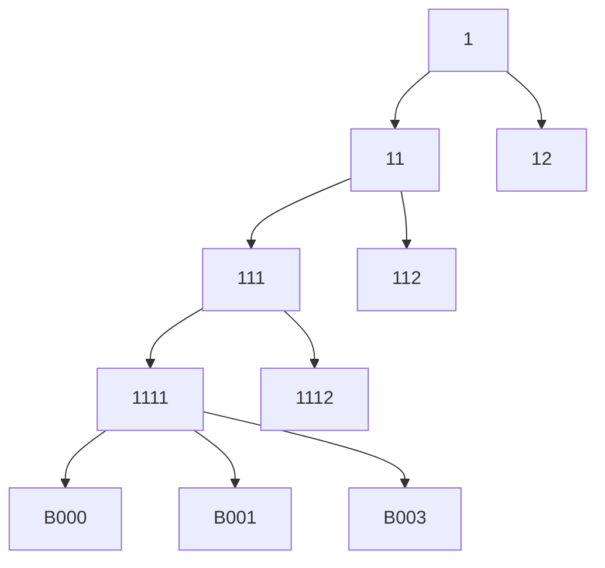
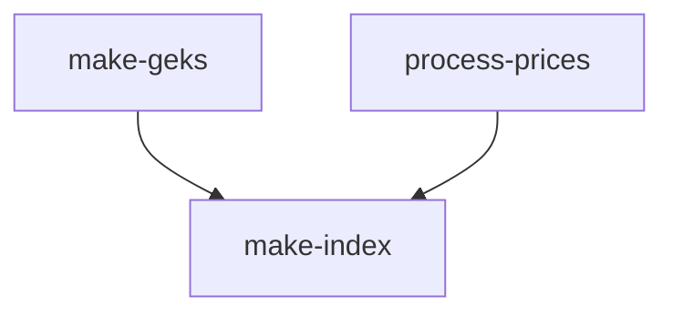

# Price index RAP

This repo contains an example of a simple pipeline to make a price index with dvc.

To make the example concrete, consider building a fairly standard hierarchical price index for the retail services
industry over a five year period. Price data come from a sample of 1,000 businesses and revenue weights for
aggregation come from a statistical register of businesses.
Each business is assigned a four-digit hierarchical code to classify the sub-sector
of the retail services industry in which that businesses operates. The index is
constructed by first calculating elementary indexes for each business and then
aggregating the elementary indexes with an arithmetic (Lowe or Young, depending
on the interpretation of the weights) index.



Prices are collected from most business with a monthly survey to capture the prices
of 10 products each month. These data are first processed and then used to construct
a Jevons elementary index for each business each month. Ten businesses are not
given a survey as pre-processed retail-scanner data are available for the parent enterprise of
these businesses. A Fisher GEKS index is made for the parent enterprise and used as the
elementary index for these 10 businesses each month. This index is not revisable and
so the GEKS index is made over a 13-month rolling window and combined with a mean splice.

## Setup

Start by clong this repository, then use conda to setup an environment.

```
conda env create -f environment.yml
conda activate price-index-pipeline

dvc init
```

## Make the data

Make aggregation weights and raw price quotes from businesses in \data and put
these data under version control. This produces both survey-like and
scanner-like price data.

```
Rscript make-weights.R
Rscript make-prices.R 2020-01 2024-12

dvc add data/raw-survey-prices.parquet data/scanner-prices.parquet data/weights.parquet
```

## Make the index

The index is made by first processing the raw survey prices to remove
extreme prices and making the GEKS elementary indexes. The remaining elementary
indexes are calculated from the processed survey-like data, and the aggregation
weights are used to build the hierarchical index (along with product contributions).

```
dvc repro
```



The results can be put under version control.

```
git add .
git commit -m "Index for 2024-12"
git tag -a "2024-12" -m "Index for 2024-12"
```

